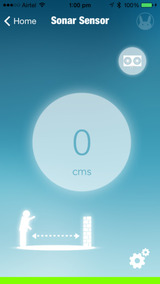

Tah Sensor
=======
We interact with a lot of devices everyday. Almost all of these can be made smarter by bringing a smartphone and TAH together. TAH is a Bluetooth 4.0 enabled development platform that is compatible with the Arduino.

TAH can be used in combination with various sensors and shields to breathe new life into the gadgets you use everyday to make them smarter and more interactive.

   
<a href="https://itunes.apple.com/us/app/tah-sensor/id911694655?mt=8"></img></a>

---

## Usage

#### Arduino
* Install the
[Tah Arduino Library](https://github.com/tah-io/Tah_Arduino_Library#installing)
* Download the
[Tah Sensor sketch](https://raw.githubusercontent.com/tah-io/Tah-Sensor/master/SensorSketch/Sensor.ino)
and open it in the Arduino IDE
* Upload it on your Tah board

#### iOS
* Clone the repo

		git clone https://github.com/tah-io/Tah-Sensor.git

* Change directory to the appropriate submodule (iOS or Android)

		cd Tah-Sensor-iOS

* Initialize and update the submodule

		git submodule init
		git submodule update
* Open the Xcode project file TAH Sensor.xcodeproj 

